# 16QAM Models Best Results

| Model | Epoch | MAE AUC | MSE AUC | PER AUC | Rel AUC |
|---|---:|---:|---:|---:|---:|
| conv_vae | 179 | 0.880970 | 0.939872 | 0.988436 | 0.867810 |
| aae | 199 | 0.838679 | 0.875546 | 0.961373 | 0.816951 |
| beta_vae | 164 | 0.833666 | 0.904798 | 0.983380 | 0.747765 |
| conv_ae | 59 | 0.859995 | 0.896503 | 0.979571 | 0.893470 |

## Test Spectrogram Comparison

> Each image is a grid sampled from the 16QAM test set (`input` vs `reconstruction`).

| Model | Normal Input | Normal Output | Anomaly Input | Anomaly Output |
|---|---|---|---|---|
| conv_vae | 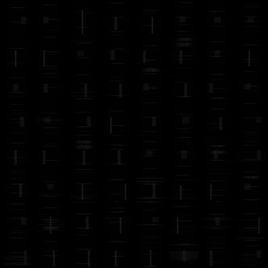 | 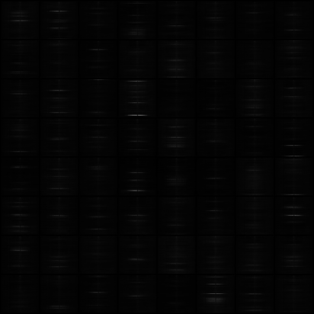 |  | 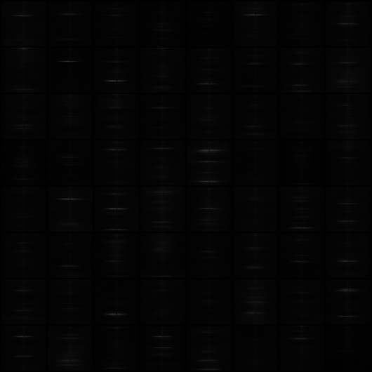 |
| aae |  | 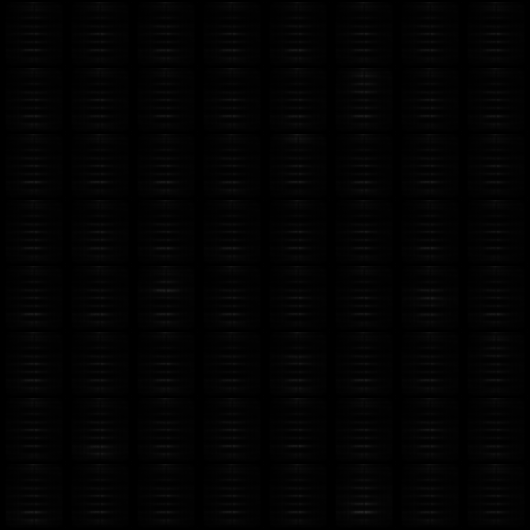 | 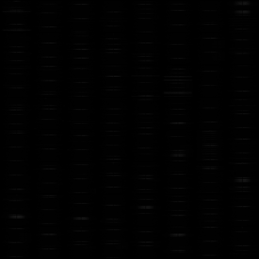 | 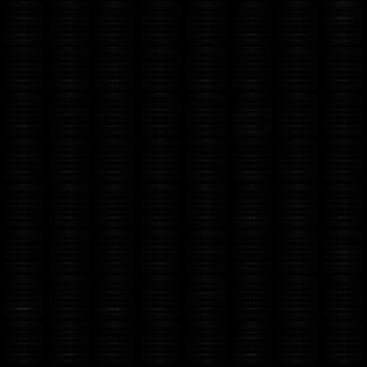 |
| beta_vae |  | 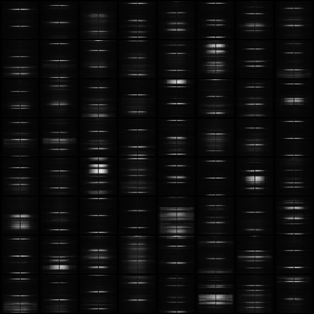 | 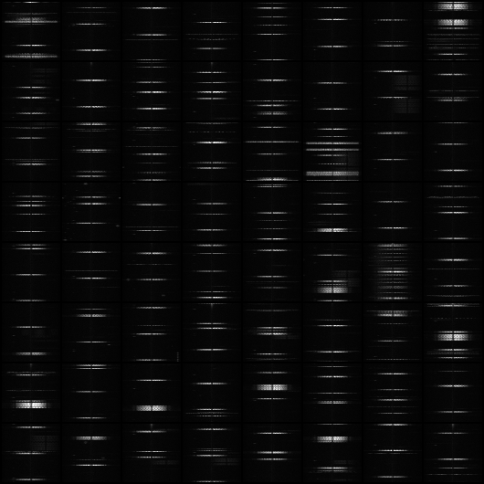 | 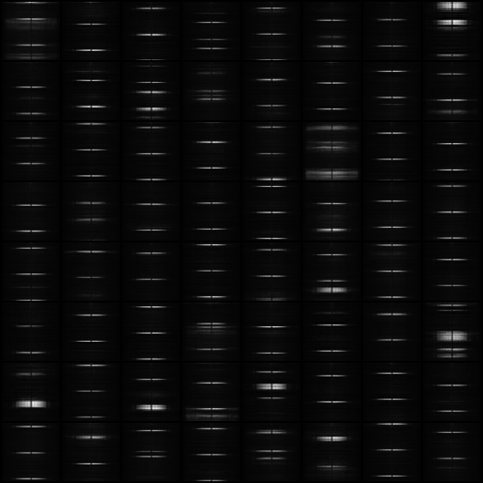 |
| conv_ae | 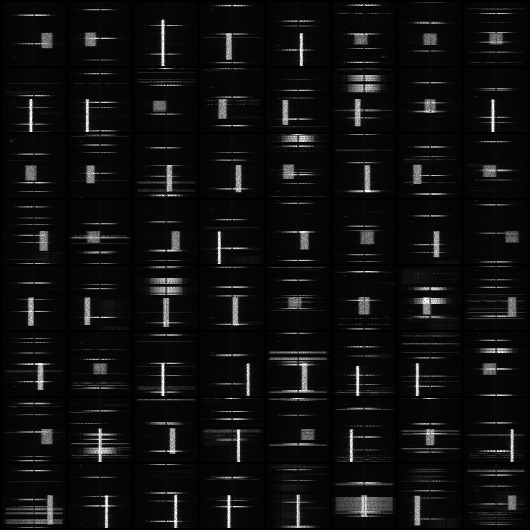 | 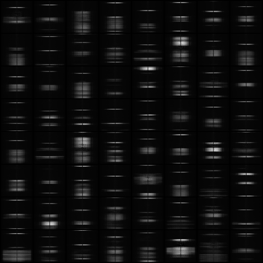 |  | 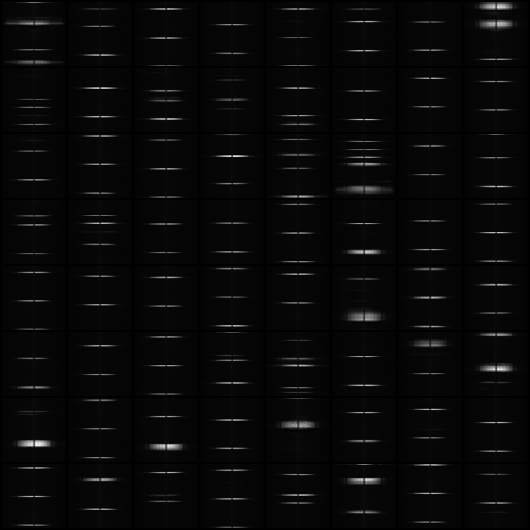 |

## Training Scope

- Dataset: **IAD 16QAM**.
- Epochs: 200 
- Additional cross-dataset checks were run on **CHIRP / GMSK / QPSK** (60-epoch quick validation) to test trend consistency.

## Brief Analysis

- In this setting, `conv_vae` is the strongest baseline on overall metrics.
- `beta_vae` improves significantly after tuning (`input_scale=10`, no output sigmoid, tuned beta), and is close to `conv_vae` on PER.
- `conv_ae` is competitive (near `beta_vae`) but its current best comes from a shorter run, so direct ranking vs 200-epoch runs is not fully fair.
- `aae` is currently the weakest among the four under the tested setup.

## Next Improvements

- Add small per-dataset hyperparameter tuning instead of one shared setting (especially `beta`, LR, and regularization).
- Stabilize metric comparability by keeping PER settings and input/output scaling fixed across all model runs.
- For `aae`, prioritize training-stability upgrades (objective/regularization schedule) before further architecture changes.
